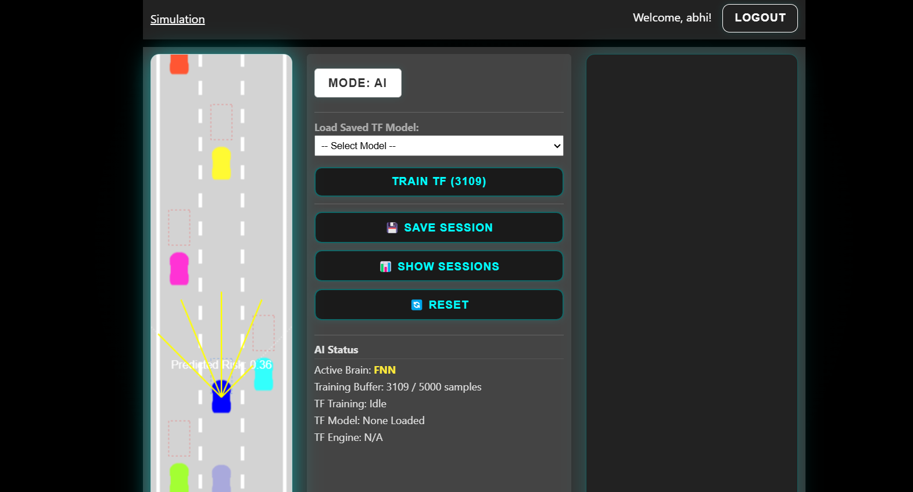

# TensorDrive
[](https://opensource.org/licenses/MIT) 

This project presents a full-stack web application simulating self-driving cars within a 2D environment. Its core innovation lies in an end-to-end machine learning pipeline operating directly within the browser:
1.  AI agents are initially controlled by a basic Feedforward Neural Network (FNN).
2.  Driving data (sensor inputs, risk assessment, control outputs) from the best-performing FNN agent is continuously captured.
3.  A TensorFlow.js (TF.js) model is asynchronously trained in the browser background using this captured data.
4.  Upon reaching a defined performance threshold (based on training loss), the system automatically performs a "brain handoff," switching vehicle control to the newly trained, more capable TF.js model.

The platform supports user authentication, persistent storage of simulation results and training data, and basic model management features.



## Core Pipeline: FNN -> TF.js Training -> Handoff

1.  **FNN Control**: AI cars start with a standard FNN, potentially evolved using basic genetic algorithm principles (persisted via `localStorage`).
2.  **Data Capture**: Sensor readings, risk scores, and FNN control actions from the current "best" car are collected.
3.  **Buffering**: Captured data points (`{input, output}`) are stored in a frontend buffer.
4.  **Backend Sync**: Data batches are periodically sent to the backend for persistent storage, associated with the logged-in user.
5.  **TF.js Training**: When the buffer reaches a threshold, the collected data is used to train a TF.js model (`tf.Sequential`) using `model.fit()` within the browser. Training occurs incrementally on the existing TF.js model instance.
6.  **Evaluation**: After training, the model's loss is checked against a target threshold (`TARGET_LOSS`).
7.  **Model Update & Handoff**: If the target loss is met:
    * The `TfBrain` component is updated with the newly trained model weights.
    * The system flags the TF model as ready (`tfModelReady = true`).
    * If in AI mode, control automatically switches (`isTFActive = true`), and subsequent control signals come from `TfBrain.predict()` instead of the FNN.
    * The successfully trained model is automatically uploaded to the backend.

## Key Features

* **Real-time 2D Simulation**: Dynamic environment using HTML Canvas API, simulating car physics, sensors (raycasting), collision detection, and traffic patterns.
* **Dual Brain System**: Seamlessly manages control between a basic FNN and a trainable TF.js model.
* **In-Browser Machine Learning**: Leverages TensorFlow.js for client-side model training and inference, enabling user-specific model refinement without server-side GPU dependencies for training.
* **Automated Control Handoff**: Dynamically switches AI control based on TF.js model training performance.
* **Full-Stack Architecture**: Robust separation of concerns between the React frontend and the Node.js/Express backend API.
* **User Authentication**: Secure registration and login using bcrypt password hashing and JWT for session management.
* **Persistent User Data**: Stores user accounts, simulation session summaries (score, model used), and captured training data in a PostgreSQL database.
* **Model Persistence & Loading**: Automatically uploads trained TF.js models; allows users to browse and load previously saved models.

## Tech Stack

* **Frontend**: React 19, TypeScript, TensorFlow.js, React Router 7, CSS
* **Backend**: Node.js, Express 5, TypeScript, PostgreSQL (`pg` driver), JWT (`jsonwebtoken`), Bcrypt, Multer
* **Database**: PostgreSQL
* **Development**: `nodemon`, `ts-node`, `concurrently` (optional)

## Architecture

* **Client-Server**: Standard web architecture with a React SPA consuming a RESTful API provided by the Node.js/Express backend.
* **Static Files**: Backend serves trained model files (`.json`, `.bin`) statically from the `server/public/models/` directory.
* **API Routes**: Backend exposes endpoints under `/api/` for authentication, session management, model listing/upload, and training data submission.

## Prerequisites

* Node.js (v14.x or later recommended)
* npm (v6 or later) or yarn (v1 or later)
* PostgreSQL Server (running locally or accessible)

## Setup & Installation

1.  **Clone Repository:**
    ```bash
    git clone https://github.com/abhisek343/TensorDrive.git
    cd <your-repository-name>
    ```

2.  **Backend Setup:**
    ```bash
    cd server
    npm install

    # Create .env file
    cp .env.example .env # Or create manually

    # --> EDIT .env file <--
    # Fill in your PostgreSQL connection details (DB_USER, DB_PASSWORD, DB_NAME, etc.)
    # Set a strong, unique JWT_SECRET
    ```

3.  **Database Setup:**
    * Ensure your PostgreSQL server is running.
    * Connect using `psql` or a GUI tool (like DBeaver, pgAdmin).
    * Create the database specified in your `.env` file (e.g., `CREATE DATABASE carlogic;`).
    * Connect to the newly created database.
    * Execute the SQL commands from a `schema.sql` file ( **Note:** You need to create this file based on your table structure) to create the `users`, `models`, `sessions`, and `training_data` tables with the correct columns, types, constraints, and foreign keys. (See example SQL in the previous README draft or ensure your schema file is present).

4.  **Nodemon Configuration (Recommended):**
    * Create a `nodemon.json` file in the `server/` directory (if it doesn't exist).
    * Add the following content to prevent restarts when models are uploaded:
        ```json
        // server/nodemon.json
        {
          "watch": ["src"],
          "ext": "ts,json",
          "ignore": [
            "src/**/*.spec.ts",
            "node_modules",
            "build",
            "public/models/*"
          ],
          "exec": "ts-node ./src/server.ts"
        }
        ```

5.  **Frontend Setup:**
    ```bash
    cd ../client
    npm install
    ```

## Running the Application

You'll need two separate terminals.

1.  **Start Backend Server:**
    ```bash
    cd server
    npm start # Assumes start script runs nodemon configured as above
    ```
    *(Wait for logs indicating the server is running and DB is connected, typically on port 5000)*

2.  **Start Frontend Client:**
    ```bash
    cd ../client
    npm start
    ```
    *(This should automatically open the application in your default browser, usually at `http://localhost:3000`)*

3.  **Usage:**
    * Register a new user or log in.
    * Navigate to the simulation page.
    * The simulation should start with FNN-controlled cars.
    * Data will be captured, and TF.js training will occur periodically (check console logs).
    * Once a model meets the `TARGET_LOSS`, control should automatically switch to TF.js for the lead car.
    * Use the controls to save sessions or load previously uploaded models.

---

## 📝 License

**MIT License**  
© 2025 Abhisek Behera
